# Design Document: Sistema de Pruebas RAG

## Overview

Este documento describe el diseño técnico de un sistema de pruebas completo para validar un proyecto RAG (Retrieval-Augmented Generation) que utiliza LangChain, ChromaDB y LM Studio. El **producto bajo prueba** ha evolucionado: la interfaz principal es **`app_lmstudio.py`** (Streamlit con pestañas, indexación de carpeta de oficina, memoria conversacional, modos tipo NotebookLM, **cuestionario interactivo** con opciones A–D y comprobación de respuestas, **persistencia en `st.session_state`** de último resumen/cuestionario/guía con acciones **Guardar** e **Imprimir**, **multiselect de documentos indexados** para acotar el contexto RAG, y panel lateral LM Studio con **embed opcional** vía `LM_STUDIO_EMBED_URL` y arranque del escritorio con **`LM_STUDIO_EXECUTABLE`**). Está apoyada en **`office_docs.py`** (incluye **`indexar_carpeta_en_sistema`** compartido con la CLI), **`chroma_lm.py`** (`PersistentClient` sobre `./chroma_db`), **`rag_chain_lm.py`**, **`prompts_notebooklm.py`** y **`rag_modes_lm.py`** (en modo cuestionario, el contexto de recuperación incluye **ruta de archivo por fragmento** para trazabilidad). La CLI **`reindex.py`** permite reindexar desde cron o tras sincronizar una carpeta de la nube a disco (sin Streamlit ni LM Studio). Siguen existiendo módulos legados (`app_dashboard.py`, `rag_chain.py`, `ingesta.py`) que pueden mantenerse en el alcance de pruebas si siguen en uso. El sistema de pruebas proporcionará cobertura de los componentes críticos mediante pruebas unitarias, de integración y basadas en propiedades.

**Documentación del producto (presentación y manuales):** [README.md](../../../README.md) (entrada al repositorio), [docs/MANUAL_USUARIO.md](../../../docs/MANUAL_USUARIO.md), [docs/MANUAL_DESARROLLO.md](../../../docs/MANUAL_DESARROLLO.md), [docs/CASOS_DE_USO.md](../../../docs/CASOS_DE_USO.md), [docs/DIAGRAMAS_UML_MERMAID.md](../../../docs/DIAGRAMAS_UML_MERMAID.md). Los **requisitos funcionales** resumidos (RF-01–RF-14) están en [requirements.md](./requirements.md#documentación-de-requisitos-funcionales-del-producto).

### Objetivos del Diseño

1. **Validación Completa**: Verificar todos los componentes del sistema RAG (ingesta, recuperación, agente, API, dashboard)
2. **Aislamiento de Dependencias**: Utilizar mocks para LM Studio y ChromaDB cuando sea necesario para pruebas rápidas y deterministas
3. **Automatización**: Integrar las pruebas en un pipeline CI/CD para detección temprana de regresiones
4. **Mantenibilidad**: Estructura modular con fixtures reutilizables y código de prueba claro
5. **Cobertura**: Alcanzar al menos 80% de cobertura de código con énfasis en rutas críticas

### Alcance

El sistema de pruebas cubrirá (prioridad actual):
- **Carga e indexación de documentación de oficina** (`office_docs.py`): carpetas `./docs` o rutas absolutas, recursivo, formatos PDF/TXT/MD/DOCX, vectorización con reemplazo total o fusión incremental; **`reindex.py`** reutiliza `indexar_carpeta_en_sistema` para ingesta programada (cron, post-rclone)
- **Cadena RAG LM Studio** (`rag_chain_lm.py`) y ejecución multimodo (`rag_modes_lm.py`, `prompts_notebooklm.py`)
- **Interfaz Streamlit** (`app_lmstudio.py`): chat con memoria; resumen, cuestionario JSON **con UI interactiva** (opciones, comprobación, explicación y referencia a fragmento/fuente), guía de estudio; **filtrado por documentos**; selector de modelo; panel LM Studio (embed/escritorio); botones de indexación; **guardar/imprimir** salidas generadas
- Módulo de ingesta clásico (`ingesta.py`) y cadena legada (`rag_chain.py`) si permanecen en el proyecto
- Herramientas y agente (`agent.py` / `agent_lmstudio.py`)
- API REST (`api_service.py` / `api_service_lmstudio.py`)
- Dashboard legado (`app_dashboard.py`) si aplica
- Integración con LM Studio (API OpenAI-compatible, **ids de modelo reales**) y ChromaDB
- Manejo de errores y casos límite

## Architecture

### Estructura General del Sistema de Pruebas

```
tests/
├── conftest.py                 # Fixtures compartidas y configuración pytest
├── test_ingesta.py            # Pruebas del módulo de ingesta
├── test_rag_chain.py          # Pruebas de la cadena RAG
├── test_agent.py              # Pruebas del agente y herramientas
├── test_api.py                # Pruebas del servicio API REST
├── test_dashboard.py          # Pruebas del dashboard Streamlit legado (opcional)
├── test_app_lmstudio.py       # Pruebas de la app Streamlit principal (app_lmstudio.py)
├── test_office_docs.py        # Pruebas de office_docs (carga por carpeta, vectorizar)
├── test_rag_modes_lm.py       # Pruebas de modos y prompts (rag_modes_lm, prompts_notebooklm)
├── test_integration.py        # Pruebas de integración end-to-end
├── test_properties.py         # Pruebas basadas en propiedades
├── fixtures/
│   ├── test_documents/        # Documentos de prueba (PDF, TXT)
│   ├── mock_responses.py      # Respuestas mock de LM Studio
│   └── test_data.py           # Datos de prueba estructurados
├── mocks/
│   ├── mock_lm_studio.py      # Mock del servidor LM Studio
│   └── mock_chromadb.py       # Mock de ChromaDB (si necesario)
└── utils/
    ├── assertions.py          # Aserciones personalizadas
    └── helpers.py             # Funciones auxiliares de prueba
```

### Arquitectura de Capas

El sistema de pruebas sigue una arquitectura de tres capas:

1. **Capa de Fixtures**: Proporciona datos de prueba, mocks y configuración compartida
2. **Capa de Pruebas Unitarias**: Valida componentes individuales en aislamiento
3. **Capa de Pruebas de Integración**: Verifica la interacción entre componentes

```mermaid
graph TB
    subgraph "Test Infrastructure"
        Fixtures[Fixtures & Mocks]
        Config[pytest Configuration]
    end
    
    subgraph "Unit Tests"
        UT1[test_ingesta.py]
        UT2[test_rag_chain.py]
        UT2b[test_rag_chain_lm.py]
        UT3[test_agent.py]
        UT4[test_api.py]
        UT5[test_dashboard.py]
        UT6[test_app_lmstudio.py]
        UT7[test_office_docs.py]
        UT8[test_rag_modes_lm.py]
    end
    
    subgraph "Integration Tests"
        IT1[test_integration.py]
        IT2[test_properties.py]
    end
    
    subgraph "RAG System Under Test"
        Ingesta[ingesta.py]
        Office[office_docs.py]
        RAG[rag_chain.py]
        RAGlm[rag_chain_lm.py]
        Modes[rag_modes_lm.py]
        Prompts[prompts_notebooklm.py]
        Agent[agent.py]
        API[api_service.py]
        AppLM[app_lmstudio.py]
        Dashboard[app_dashboard.py]
    end
    
    Fixtures --> UT1
    Fixtures --> UT2
    Fixtures --> UT3
    Fixtures --> UT4
    Fixtures --> UT5
    Fixtures --> IT1
    Fixtures --> IT2
    
    Config --> UT1
    Config --> UT2
    Config --> UT3
    Config --> UT4
    Config --> UT5
    Config --> IT1
    Config --> IT2
    
    UT1 --> Ingesta
    UT2 --> RAG
    UT3 --> Agent
    UT4 --> API
    UT5 --> Dashboard
    UT6 --> AppLM
    UT7 --> Office
    UT8 --> Modes
    
    IT1 --> Ingesta
    IT1 --> RAG
    IT1 --> Agent
    IT1 --> API
    
    IT2 --> Ingesta
    IT2 --> RAG
```



### Estrategia de Mocking

Para aislar componentes y acelerar las pruebas, utilizaremos mocks para:

1. **LM Studio Mock Server**: Servidor HTTP simulado que responde a solicitudes de generación de texto
2. **ChromaDB Mock**: Mock opcional para pruebas que no requieren persistencia real
3. **File System Mock**: Para pruebas de ingesta sin archivos reales cuando sea apropiado

## Producto: módulos añadidos (fuente de verdad y UI)

| Módulo | Rol |
|--------|-----|
| `office_docs.py` | Listar archivos por extensión, cargar PDF/TXT/MD/DOCX, `vectorizar_y_persistir` con `reemplazar_indice` para índice único o fusión |
| `rag_chain_lm.py` | `ChatOpenAI` contra `LM_STUDIO_BASE_URL`, modelo `LM_STUDIO_MODEL` (id real), Chroma `DB_PATH` |
| `prompts_notebooklm.py` | `APP_CONTEXT_FOR_MODEL`, `ModoContenido`, plantillas chat / memoria / resumen / cuestionario / guía |
| `rag_modes_lm.py` | `ejecutar_modo`: recuperación + prompt por modo; historial opcional para chat; en **CUESTIONARIO**, contexto con `(archivo: ruta)` por fragmento; parseo JSON de cuestionario |
| `chroma_lm.py` | Cliente Chroma persistente (`PersistentClient`) y utilidades sobre `DB_PATH` |
| `app_lmstudio.py` | Streamlit: sidebar modelo + multiselect de fuentes + LM Studio (embed `LM_STUDIO_EMBED_URL`); pestañas; indexación `docs/` o ruta absoluta; subida a `docs/`; `_render_cuestionario_interactivo`, `_render_guardar_imprimir`, mensajes si el modelo no está cargado |

**Scripts de arranque:** `run_streamlit_lmstudio.sh`, `run_api_lmstudio.sh` (activan venv y exportan modelo por defecto).

## Components and Interfaces

### 1. Módulo de Configuración de Pruebas (conftest.py)

**Responsabilidad**: Proporcionar fixtures compartidas y configuración global de pytest.

**Fixtures Principales**:

```python
@pytest.fixture(scope="session")
def mock_lm_studio_server():
    """Inicia un servidor mock de LM Studio para toda la sesión de pruebas"""
    
@pytest.fixture(scope="function")
def temp_chroma_db(tmp_path):
    """Crea una base de datos ChromaDB temporal para cada prueba"""
    
@pytest.fixture(scope="session")
def test_documents():
    """Proporciona documentos de prueba (PDF y TXT)"""
    
@pytest.fixture(scope="function")
def clean_environment():
    """Limpia el entorno antes y después de cada prueba"""
    
@pytest.fixture(scope="function")
def mock_embeddings():
    """Proporciona embeddings mock para pruebas rápidas"""
```

**Configuración pytest.ini**:
```ini
[pytest]
testpaths = tests
python_files = test_*.py
python_classes = Test*
python_functions = test_*
addopts = 
    --verbose
    --cov=.
    --cov-report=html
    --cov-report=term-missing
    --cov-fail-under=80
markers =
    unit: Unit tests
    integration: Integration tests
    slow: Slow running tests
    requires_lm_studio: Tests that need real LM Studio
```

### 2. Mock del Servidor LM Studio (mocks/mock_lm_studio.py)

**Responsabilidad**: Simular el comportamiento del servidor LM Studio para pruebas deterministas.

**Interfaz**:

```python
class MockLMStudioServer:
    def __init__(self, port: int = 1234):
        """Inicializa el servidor mock en el puerto especificado"""
        
    def start(self):
        """Inicia el servidor HTTP en un thread separado"""
        
    def stop(self):
        """Detiene el servidor y limpia recursos"""
        
    def set_response(self, response: str):
        """Configura la respuesta que el servidor devolverá"""
        
    def set_error(self, error_code: int, message: str):
        """Configura el servidor para devolver un error"""
        
    def get_request_history(self) -> List[Dict]:
        """Retorna el historial de solicitudes recibidas"""
```

**Comportamiento**:
- Responde a POST /v1/chat/completions con respuestas configurables
- Simula latencia configurable
- Puede simular errores de conexión y timeouts
- Registra todas las solicitudes para verificación

### 3. Módulo de Pruebas de Ingesta (test_ingesta.py)

**Responsabilidad**: Validar el módulo de ingesta de documentos.

**Casos de Prueba Principales**:

```python
class TestIngesta:
    def test_load_pdf_document(self, temp_chroma_db, test_documents):
        """Verifica que se carguen correctamente documentos PDF"""
        
    def test_load_txt_document_utf8(self, temp_chroma_db, test_documents):
        """Verifica que se carguen documentos TXT con codificación UTF-8"""
        
    def test_document_chunking(self, test_documents):
        """Verifica que los documentos se dividan en chunks de tamaño correcto"""
        
    def test_embedding_generation(self, temp_chroma_db, test_documents):
        """Verifica que se generen embeddings para los chunks"""
        
    def test_chromadb_storage(self, temp_chroma_db, test_documents):
        """Verifica que los embeddings se almacenen en ChromaDB"""
        
    def test_unsupported_file_format(self, temp_chroma_db):
        """Verifica que se manejen archivos no soportados"""
        
    def test_missing_docs_folder(self, temp_chroma_db):
        """Verifica el manejo de carpeta de documentos inexistente"""
        
    def test_chunk_count_matches_expected(self, temp_chroma_db, test_documents):
        """Verifica que el número de chunks coincida con lo esperado"""
```

### 4. Módulo de Pruebas de RAG Chain (test_rag_chain.py)

**Responsabilidad**: Validar la cadena de recuperación y generación.

**Casos de Prueba Principales**:

```python
class TestRAGChain:
    def test_retrieve_relevant_chunks(self, temp_chroma_db, mock_lm_studio_server):
        """Verifica que se recuperen los 4 chunks más relevantes"""
        
    def test_send_context_to_lm_studio(self, temp_chroma_db, mock_lm_studio_server):
        """Verifica que se envíe contexto a LM Studio"""
        
    def test_lm_studio_unavailable(self, temp_chroma_db):
        """Verifica el manejo de LM Studio no disponible"""
        
    def test_no_relevant_information(self, temp_chroma_db, mock_lm_studio_server):
        """Verifica respuesta cuando no hay información relevante"""
        
    def test_relevance_scores_threshold(self, temp_chroma_db):
        """Verifica que los chunks tengan scores de relevancia adecuados"""
        
    def test_source_tracking(self, temp_chroma_db, mock_lm_studio_server):
        """Verifica que se rastreen correctamente los documentos fuente"""
        
    def test_query_idempotence(self, temp_chroma_db, mock_lm_studio_server):
        """Verifica que la misma consulta retorne resultados consistentes"""
```

### 5. Módulo de Pruebas del Agente (test_agent.py)

**Responsabilidad**: Validar las herramientas del agente y su ejecución.

**Casos de Prueba Principales**:

```python
class TestAgentTools:
    def test_consultar_documentos_tool(self, temp_chroma_db, mock_lm_studio_server):
        """Verifica la herramienta consultar_documentos"""
        
    def test_obtener_fecha_actual_tool(self):
        """Verifica la herramienta obtener_fecha_actual"""
        
    def test_buscar_palabra_clave_tool(self, temp_chroma_db):
        """Verifica la herramienta buscar_palabra_clave_en_texto"""
        
    def test_tool_error_handling(self, temp_chroma_db):
        """Verifica el manejo de errores en herramientas"""
        
    def test_tool_return_types(self):
        """Verifica que cada herramienta retorne el tipo de dato esperado"""
        
    def test_tool_execution_time(self, temp_chroma_db, mock_lm_studio_server):
        """Verifica que las herramientas se ejecuten en tiempo aceptable"""

class TestCLIInterface:
    def test_cli_initialization(self, temp_chroma_db, mock_lm_studio_server):
        """Verifica la inicialización de la interfaz CLI"""
        
    def test_process_user_query(self, temp_chroma_db, mock_lm_studio_server):
        """Verifica el procesamiento de consultas de usuario"""
        
    def test_verbose_mode_reasoning(self, temp_chroma_db, mock_lm_studio_server):
        """Verifica que se muestre el razonamiento en modo verbose"""
        
    def test_max_iterations_limit(self, temp_chroma_db, mock_lm_studio_server):
        """Verifica el límite de iteraciones máximas"""
        
    def test_parsing_error_handling(self, temp_chroma_db, mock_lm_studio_server):
        """Verifica el manejo de errores de parsing"""
        
    def test_consecutive_queries(self, temp_chroma_db, mock_lm_studio_server):
        """Verifica el procesamiento de múltiples consultas consecutivas"""
```

### 6. Módulo de Pruebas de API (test_api.py)

**Responsabilidad**: Validar el servicio API REST.

**Casos de Prueba Principales**:

```python
class TestAPIService:
    @pytest.fixture
    def api_client(self, temp_chroma_db, mock_lm_studio_server):
        """Proporciona un cliente de prueba para la API"""
        
    def test_root_endpoint(self, api_client):
        """Verifica el endpoint raíz GET /"""
        
    def test_chat_endpoint(self, api_client):
        """Verifica el endpoint POST /chat"""
        
    def test_upload_pdf_endpoint(self, api_client, test_documents):
        """Verifica el endpoint POST /upload con PDF"""
        
    def test_upload_txt_endpoint(self, api_client, test_documents):
        """Verifica el endpoint POST /upload con TXT"""
        
    def test_upload_unsupported_format(self, api_client):
        """Verifica el rechazo de formatos no soportados"""
        
    def test_delete_session_endpoint(self, api_client):
        """Verifica el endpoint DELETE /session/{session_id}"""
        
    def test_session_context_maintenance(self, api_client):
        """Verifica el mantenimiento de contexto por sesión"""
        
    def test_lm_studio_unavailable_error(self, api_client):
        """Verifica el manejo de LM Studio no disponible"""
        
    def test_api_response_time(self, api_client):
        """Verifica los tiempos de respuesta de la API"""
```

### 7. Módulo de Pruebas de Integración (test_integration.py)

**Responsabilidad**: Validar flujos end-to-end del sistema completo.

**Casos de Prueba Principales**:

```python
class TestEndToEndWorkflows:
    def test_full_ingestion_to_query_workflow(self, temp_chroma_db, mock_lm_studio_server):
        """Verifica el flujo completo: ingesta -> indexación -> consulta -> respuesta"""
        
    def test_api_upload_and_query_workflow(self, api_client, test_documents):
        """Verifica el flujo: upload via API -> query via API"""
        
    def test_multi_session_isolation(self, api_client):
        """Verifica el aislamiento entre sesiones diferentes"""
        
    def test_error_recovery_workflow(self, temp_chroma_db):
        """Verifica la recuperación de errores transitorios"""
```

### 8. Módulo de Pruebas Basadas en Propiedades (test_properties.py)

**Responsabilidad**: Validar propiedades invariantes del sistema usando property-based testing.

**Framework**: Utilizaremos `hypothesis` para Python.

**Casos de Prueba Principales**:

```python
class TestSystemProperties:
    @given(st.lists(st.text(min_size=100), min_size=1, max_size=10))
    def test_chunk_count_invariant(self, documents):
        """Verifica que el conteo de chunks sea la suma de chunks de todos los documentos"""
        
    @given(st.text(min_size=100))
    def test_indexing_idempotence(self, document):
        """Verifica que indexar un documento dos veces no duplique chunks"""
        
    @given(st.lists(st.text(min_size=100), min_size=2, max_size=5))
    def test_processing_order_confluence(self, documents):
        """Verifica que el orden de procesamiento no afecte el contenido indexado"""
        
    @given(st.text(min_size=10))
    def test_chunk_metadata_invariant(self, query):
        """Verifica que los chunks recuperados siempre tengan metadata válida"""
        
    @given(st.lists(st.text(min_size=10), min_size=1, max_size=20))
    def test_conversation_memory_growth(self, messages):
        """Verifica que la memoria de conversación crezca linealmente"""
        
    @given(st.text(min_size=10), st.text(min_size=10))
    def test_session_isolation(self, session_a_query, session_b_query):
        """Verifica que las sesiones estén aisladas entre sí"""
```

## Data Models

### Test Document Structure

```python
@dataclass
class TestDocument:
    """Representa un documento de prueba"""
    filename: str
    content: str
    file_type: str  # 'pdf' or 'txt'
    expected_chunks: int
    metadata: Dict[str, Any]
```

### Mock Response Structure

```python
@dataclass
class MockLMStudioResponse:
    """Estructura de respuesta del mock de LM Studio"""
    id: str
    object: str = "chat.completion"
    created: int = field(default_factory=lambda: int(time.time()))
    model: str = "meta-llama-3.1-8b-instruct"  # o id configurable; evitar placeholder obsoleto "local-model"
    choices: List[Dict[str, Any]] = field(default_factory=list)
    usage: Dict[str, int] = field(default_factory=dict)
```

### Test Result Structure

```python
@dataclass
class TestResult:
    """Estructura para resultados de pruebas personalizadas"""
    test_name: str
    passed: bool
    execution_time: float
    error_message: Optional[str] = None
    metadata: Dict[str, Any] = field(default_factory=dict)
```

### ChromaDB Test Collection

```python
class TestChromaCollection:
    """Wrapper para colecciones de ChromaDB en pruebas"""
    def __init__(self, path: Path):
        self.path = path
        self.client = chromadb.PersistentClient(path=str(path))
        self.collection = None
        
    def create_collection(self, name: str) -> chromadb.Collection:
        """Crea una colección de prueba"""
        
    def get_document_count(self) -> int:
        """Retorna el número de documentos en la colección"""
        
    def cleanup(self):
        """Limpia la colección y libera recursos"""
```

### API Test Models

```python
@dataclass
class ChatRequest:
    """Modelo para solicitudes de chat en pruebas"""
    session_id: str
    pregunta: str

@dataclass
class ChatResponse:
    """Modelo para respuestas de chat en pruebas"""
    respuesta: str
    timestamp: str
    session_id: str
    sources: Optional[List[str]] = None

@dataclass
class UploadRequest:
    """Modelo para solicitudes de upload en pruebas"""
    file: bytes
    filename: str
    content_type: str
```


## Correctness Properties

*A property is a characteristic or behavior that should hold true across all valid executions of a system-essentially, a formal statement about what the system should do. Properties serve as the bridge between human-readable specifications and machine-verifiable correctness guarantees.*

Las siguientes propiedades definen el comportamiento correcto del sistema de pruebas RAG. Cada propiedad está cuantificada universalmente y debe verificarse mediante property-based testing con al menos 100 iteraciones.

### Property 1: Document Loading and Chunking

*For any* valid document file (PDF or TXT) with sufficient content, when the Ingestion_Module processes it, the system SHALL create chunks with size 500 and overlap 50, and the total number of chunks SHALL be deterministic based on document length.

**Validates: Requirements 1.1, 1.2, 1.3**

### Property 2: Embedding Storage Round-Trip

*For any* set of document chunks, when embeddings are generated and stored in ChromaDB, retrieving them from the database SHALL return embeddings with the same dimensionality and associated metadata including source file path.

**Validates: Requirements 1.4, 1.5, 8.4**

### Property 3: Unsupported File Format Handling

*For any* file with an unsupported format (not PDF or TXT), when the Ingestion_Module processes it, the system SHALL skip the file without crashing and continue processing remaining files.

**Validates: Requirements 1.6**

### Property 4: Chunk Count Invariant

*For any* set of documents processed together, the total number of chunks created SHALL equal the sum of chunks from each individual document processed separately.

**Validates: Requirements 8.1**

### Property 5: Retrieval Consistency

*For any* query submitted to the RAG_Chain, when ChromaDB contains at least 4 chunks, the system SHALL retrieve exactly 4 chunks with relevance scores above the minimum threshold, and submitting the same query multiple times SHALL return the same chunks (idempotence).

**Validates: Requirements 2.1, 2.5, 2.7**

### Property 6: RAG Data Integrity

*For any* query that retrieves document chunks, the response SHALL include valid source document tracking information, and the chunks sent as context to LM_Studio SHALL match the chunks retrieved from ChromaDB.

**Validates: Requirements 2.2, 2.6**

### Property 7: Agent Tool Correctness

*For any* valid input to an agent tool (consultar_documentos, obtener_fecha_actual, buscar_palabra_clave_en_texto), the tool SHALL return a value of the expected data type without crashing, and errors SHALL be handled gracefully with descriptive messages.

**Validates: Requirements 3.1, 3.2, 3.3, 3.4, 3.5**

### Property 8: CLI Query Processing

*For any* user query submitted to the CLI_Interface, when the agent executor is initialized, the system SHALL invoke the agent and return a response, displaying reasoning in verbose mode when tools are used.

**Validates: Requirements 4.2, 4.3**

### Property 9: CLI Error Resilience

*For any* parsing error or malformed input to the CLI_Interface, the system SHALL handle the error gracefully without crashing and continue accepting subsequent queries.

**Validates: Requirements 4.5**

### Property 10: API Chat Endpoint Correctness

*For any* valid session_id and pregunta sent to POST /chat, the API_Service SHALL return a ChatResponse containing a respuesta field and timestamp, and multiple requests with the same session_id SHALL maintain conversation context.

**Validates: Requirements 5.2, 5.6**

### Property 11: API Upload Endpoint Correctness

*For any* valid PDF or TXT file uploaded to POST /upload, the API_Service SHALL save the file and trigger indexing, and for any unsupported file format, SHALL return HTTP 400 error.

**Validates: Requirements 5.3, 5.4**

### Property 12: API Session Management

*For any* session_id, when a DELETE request is sent to /session/{session_id}, the API_Service SHALL clear the conversation memory for that session, and subsequent queries SHALL not have access to previous conversation history.

**Validates: Requirements 5.5**

### Property 13: LM Studio Request Validity

*For any* request sent to LM_Studio through the RAG_System, when LM_Studio is available, the system SHALL receive a valid response within the timeout period.

**Validates: Requirements 6.2**

### Property 14: Error Handling Robustness

*For any* invalid file path, malformed query, or embeddings generation failure, the system SHALL handle the error gracefully without crashing, log descriptive error messages with actionable information, and continue processing remaining operations where applicable.

**Validates: Requirements 7.2, 7.3, 7.4, 7.6**

### Property 15: Transient Error Recovery

*For any* transient error condition (temporary network failure, temporary resource unavailability), when retry logic is applicable, the system SHALL attempt recovery and eventually succeed or fail with a clear error message.

**Validates: Requirements 7.7**

### Property 16: Indexing Idempotence

*For any* document, indexing it once and indexing it twice SHALL result in the same number of chunks in ChromaDB (no duplication).

**Validates: Requirements 8.2**

### Property 17: Processing Order Confluence

*For any* set of documents, the order in which they are processed SHALL not affect the final indexed content in ChromaDB (all chunks present regardless of order).

**Validates: Requirements 8.3**

### Property 18: Conversation Memory Growth

*For any* sequence of messages in a conversation session, the conversation memory size SHALL grow linearly with the number of messages (one message added = one message in memory).

**Validates: Requirements 8.5**

### Property 19: Session Isolation

*For any* two different session IDs (session_a and session_b), queries and responses in session_a SHALL not affect or be visible to session_b, and vice versa.

**Validates: Requirements 8.6**

### Property 20: Storage Growth Proportionality

*For any* set of documents indexed in ChromaDB, the database size SHALL grow proportionally to the number of documents (approximately linear relationship between document count and storage size).

**Validates: Requirements 9.5**

## Error Handling

El sistema de pruebas debe manejar y validar múltiples escenarios de error:

### 1. Errores de Ingesta

**Escenarios**:
- Carpeta de documentos inexistente
- Archivos corruptos o ilegibles
- Formatos de archivo no soportados
- Errores de codificación (archivos no UTF-8)
- Fallos en generación de embeddings

**Estrategia de Manejo**:
- Capturar excepciones específicas (FileNotFoundError, UnicodeDecodeError, etc.)
- Registrar errores con contexto detallado
- Continuar procesando documentos restantes cuando sea posible
- Retornar lista de documentos procesados exitosamente y lista de errores

**Validación en Pruebas**:
```python
def test_ingestion_error_handling():
    # Verificar que errores no detengan el procesamiento completo
    # Verificar que se retornen mensajes de error descriptivos
    # Verificar que documentos válidos se procesen a pesar de errores en otros
```

### 2. Errores de Conexión con LM Studio

**Escenarios**:
- LM Studio no está ejecutándose
- Timeout en solicitudes
- Respuestas malformadas
- Errores HTTP (500, 503, etc.)

**Estrategia de Manejo**:
- Detectar ConnectionError y RequestException
- Implementar timeouts configurables
- Retornar mensajes de error claros al usuario
- No reintentar automáticamente (dejar que el usuario verifique LM Studio)

**Validación en Pruebas**:
```python
def test_lm_studio_connection_errors():
    # Simular LM Studio no disponible
    # Verificar mensaje de error apropiado
    # Verificar que el sistema no crashee
```

### 3. Errores de ChromaDB

**Escenarios**:
- Base de datos no inicializada
- Permisos insuficientes en directorio
- Corrupción de datos
- Espacio en disco insuficiente

**Estrategia de Manejo**:
- Verificar existencia de DB antes de operaciones
- Proporcionar mensajes claros sobre inicialización necesaria
- Capturar excepciones de ChromaDB y traducir a mensajes comprensibles

**Validación en Pruebas**:
```python
def test_chromadb_error_handling():
    # Verificar manejo de DB no inicializada
    # Verificar mensajes de error claros
    # Verificar que se sugieran acciones correctivas
```

### 4. Errores de API

**Escenarios**:
- Solicitudes malformadas (JSON inválido)
- Campos requeridos faltantes
- Tipos de datos incorrectos
- Session ID inválido
- Archivos demasiado grandes

**Estrategia de Manejo**:
- Validación de entrada con Pydantic models
- Retornar códigos HTTP apropiados (400, 404, 500)
- Incluir detalles del error en respuesta JSON
- Logging de errores para debugging

**Validación en Pruebas**:
```python
def test_api_error_responses():
    # Verificar códigos HTTP correctos
    # Verificar formato de mensajes de error
    # Verificar que errores incluyan información útil
```

### 5. Errores del Agente

**Escenarios**:
- Parsing errors en respuestas de LLM
- Max iterations alcanzado
- Herramientas que fallan
- Queries ambiguas o inválidas

**Estrategia de Manejo**:
- Configurar max_iterations apropiado
- Capturar OutputParserException
- Retornar estado actual cuando se alcanza límite
- Logging detallado del proceso de razonamiento

**Validación en Pruebas**:
```python
def test_agent_error_handling():
    # Verificar manejo de parsing errors
    # Verificar comportamiento en max_iterations
    # Verificar que herramientas fallen gracefully
```

## Testing Strategy

### Enfoque Dual: Unit Tests + Property-Based Tests

El sistema de pruebas utilizará una estrategia dual que combina:

1. **Unit Tests**: Para casos específicos, ejemplos concretos y edge cases
2. **Property-Based Tests**: Para verificar propiedades universales con múltiples inputs generados

Esta combinación proporciona:
- **Cobertura exhaustiva**: Property tests exploran muchos casos automáticamente
- **Casos específicos**: Unit tests documentan comportamientos esperados concretos
- **Detección de edge cases**: Property tests encuentran casos que no consideramos manualmente
- **Regresión**: Unit tests capturan bugs específicos que no deben reaparecer

### Framework y Herramientas

**Testing Framework**: pytest
- Fixtures para setup/teardown
- Parametrización de tests
- Markers para categorización
- Plugins para coverage y reporting

**Property-Based Testing**: Hypothesis
- Generación automática de inputs
- Shrinking de casos fallidos
- Configuración: mínimo 100 iteraciones por propiedad
- Estrategias personalizadas para tipos de datos del dominio

**Mocking**: unittest.mock + pytest-mock
- Mock de LM Studio server
- Mock de file system cuando apropiado
- Spy en llamadas para verificación

**API Testing**: pytest + httpx/requests
- TestClient para FastAPI
- Fixtures para cliente API
- Verificación de códigos HTTP y respuestas

**Coverage**: pytest-cov
- Objetivo: mínimo 80% coverage
- Reportes HTML para análisis detallado
- Exclusión de código de prueba del coverage

### Organización de Tests

#### Unit Tests

**test_ingesta.py**:
- Carga de documentos PDF y TXT
- Chunking con parámetros correctos
- Generación y almacenamiento de embeddings
- Manejo de errores (archivos no soportados, carpeta inexistente)
- Casos específicos con documentos conocidos

**test_rag_chain.py**:
- Recuperación de chunks relevantes
- Integración con LM Studio
- Manejo de LM Studio no disponible
- Tracking de fuentes
- Casos específicos de queries

**test_agent.py**:
- Cada herramienta individualmente
- Formato de fecha correcto
- Conteo de palabras clave
- Inicialización de CLI
- Procesamiento de queries consecutivas
- Manejo de errores de parsing

**test_api.py**:
- Cada endpoint individualmente
- Validación de request/response models
- Manejo de sesiones
- Upload de archivos
- Códigos de error HTTP
- Casos específicos de integración

**test_dashboard.py**:
- Renderizado de componentes
- Interacción con session state
- Llamadas a API backend
- Manejo de errores en UI

#### Integration Tests

**test_integration.py**:
- Flujo completo: ingesta → indexación → query → respuesta
- Upload via API → query via API
- Múltiples sesiones simultáneas
- Recuperación de errores transitorios
- Escenarios end-to-end realistas

#### Property-Based Tests

**test_properties.py**:
- Una función de test por cada Correctness Property (1-20)
- Uso de Hypothesis para generación de datos
- Configuración: @settings(max_examples=100)
- Tags en comentarios: `# Feature: rag-testing-system, Property X: [descripción]`

Ejemplo:
```python
from hypothesis import given, settings
from hypothesis import strategies as st

@settings(max_examples=100)
@given(st.text(min_size=100, max_size=5000))
def test_property_1_document_chunking(document_content):
    """
    Feature: rag-testing-system, Property 1: Document Loading and Chunking
    
    For any valid document with sufficient content, chunking should be
    deterministic and follow size/overlap parameters.
    """
    # Test implementation
```

### Estrategias de Generación de Datos (Hypothesis)

**Documentos**:
```python
@st.composite
def document_strategy(draw):
    content = draw(st.text(min_size=100, max_size=10000))
    file_type = draw(st.sampled_from(['pdf', 'txt']))
    return TestDocument(content=content, file_type=file_type)
```

**Queries**:
```python
queries_strategy = st.text(min_size=5, max_size=200, alphabet=st.characters(
    whitelist_categories=('Lu', 'Ll', 'Nd', 'P', 'Zs'),
    blacklist_characters='\x00\n\r\t'
))
```

**Session IDs**:
```python
session_id_strategy = st.uuids().map(str)
```

**Mensajes de Conversación**:
```python
@st.composite
def conversation_strategy(draw):
    num_messages = draw(st.integers(min_value=1, max_value=20))
    messages = [draw(st.text(min_size=5, max_size=200)) for _ in range(num_messages)]
    return messages
```

### Fixtures Compartidas

**conftest.py** proporcionará:

```python
@pytest.fixture(scope="session")
def mock_lm_studio_server():
    """Mock server que simula LM Studio"""
    server = MockLMStudioServer(port=1234)
    server.start()
    yield server
    server.stop()

@pytest.fixture(scope="function")
def temp_chroma_db(tmp_path):
    """ChromaDB temporal para cada test"""
    db_path = tmp_path / "chroma_test_db"
    db_path.mkdir()
    yield str(db_path)
    # Cleanup automático por tmp_path

@pytest.fixture(scope="session")
def test_documents():
    """Documentos de prueba conocidos"""
    return {
        'simple_pdf': TestDocument(...),
        'simple_txt': TestDocument(...),
        'large_pdf': TestDocument(...),
    }

@pytest.fixture(scope="function")
def api_client(temp_chroma_db, mock_lm_studio_server):
    """Cliente de prueba para la API"""
    from fastapi.testclient import TestClient
    from api_service import app
    
    # Configurar app con DB temporal
    app.state.db_path = temp_chroma_db
    
    with TestClient(app) as client:
        yield client

@pytest.fixture(autouse=True)
def clean_environment():
    """Limpia variables de entorno antes/después de cada test"""
    # Setup
    original_env = os.environ.copy()
    
    yield
    
    # Teardown
    os.environ.clear()
    os.environ.update(original_env)
```

### Configuración de CI/CD

**GitHub Actions** (.github/workflows/test.yml):

```yaml
name: Test Suite

on:
  push:
    branches: [ main, develop ]
  pull_request:
    branches: [ main, develop ]

jobs:
  test:
    runs-on: ubuntu-latest
    
    steps:
    - uses: actions/checkout@v3
    
    - name: Set up Python
      uses: actions/setup-python@v4
      with:
        python-version: '3.10'
    
    - name: Install dependencies
      run: |
        pip install -r requirements.txt
        pip install -r requirements-dev.txt
    
    - name: Run unit tests
      run: pytest tests/ -m "unit" --cov --cov-report=xml
    
    - name: Run integration tests
      run: pytest tests/ -m "integration" --cov --cov-append --cov-report=xml
    
    - name: Run property-based tests
      run: pytest tests/test_properties.py --cov --cov-append --cov-report=xml
    
    - name: Upload coverage to Codecov
      uses: codecov/codecov-action@v3
      with:
        file: ./coverage.xml
    
    - name: Check coverage threshold
      run: |
        coverage report --fail-under=80
```

### Métricas y Reportes

**Coverage Report**:
- HTML report generado en `htmlcov/`
- Terminal report con líneas faltantes
- Threshold mínimo: 80%
- Exclusiones: archivos de test, mocks, fixtures

**Test Execution Report**:
- Tiempo de ejecución por test
- Tests más lentos identificados
- Tasa de éxito/fallo
- Categorización por markers (unit/integration/slow)

**Property Test Report**:
- Número de ejemplos generados por propiedad
- Casos que causaron fallos (shrunk examples)
- Distribución de inputs generados
- Tiempo de ejecución por propiedad

### Ejecución de Tests

**Todos los tests**:
```bash
pytest tests/
```

**Solo unit tests**:
```bash
pytest tests/ -m "unit"
```

**Solo integration tests**:
```bash
pytest tests/ -m "integration"
```

**Solo property-based tests**:
```bash
pytest tests/test_properties.py
```

**Con coverage**:
```bash
pytest tests/ --cov --cov-report=html --cov-report=term-missing
```

**Tests específicos**:
```bash
pytest tests/test_ingesta.py::test_load_pdf_document
```

**Verbose output**:
```bash
pytest tests/ -v
```

**Excluir tests lentos**:
```bash
pytest tests/ -m "not slow"
```

### Balance entre Unit Tests y Property Tests

**Cuándo usar Unit Tests**:
- Casos específicos que documentan comportamiento esperado
- Edge cases conocidos que deben manejarse
- Ejemplos concretos de integración entre componentes
- Verificación de valores específicos (configuración, formatos)
- Regresión de bugs específicos encontrados

**Cuándo usar Property Tests**:
- Propiedades universales que deben cumplirse siempre
- Invariantes del sistema
- Propiedades de idempotencia, confluencia, round-trip
- Exploración de espacio de inputs grande
- Validación de robustez ante inputs variados

**Evitar**:
- Demasiados unit tests que solo verifican casos triviales
- Property tests para comportamientos que requieren valores específicos
- Duplicación entre unit tests y property tests sin valor agregado

El objetivo es que los property tests cubran las propiedades generales (con 100+ ejemplos cada uno), mientras que los unit tests se enfoquen en casos específicos importantes y documentación de comportamiento esperado.

