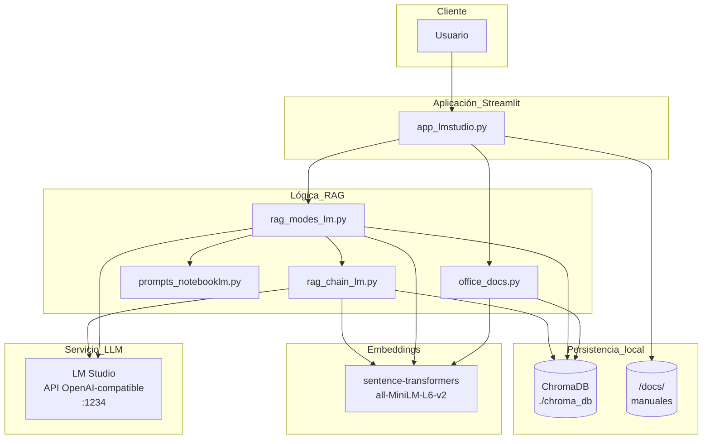
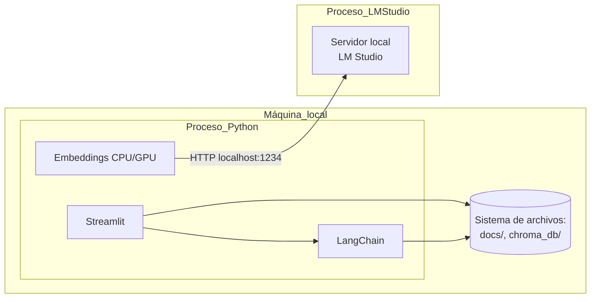
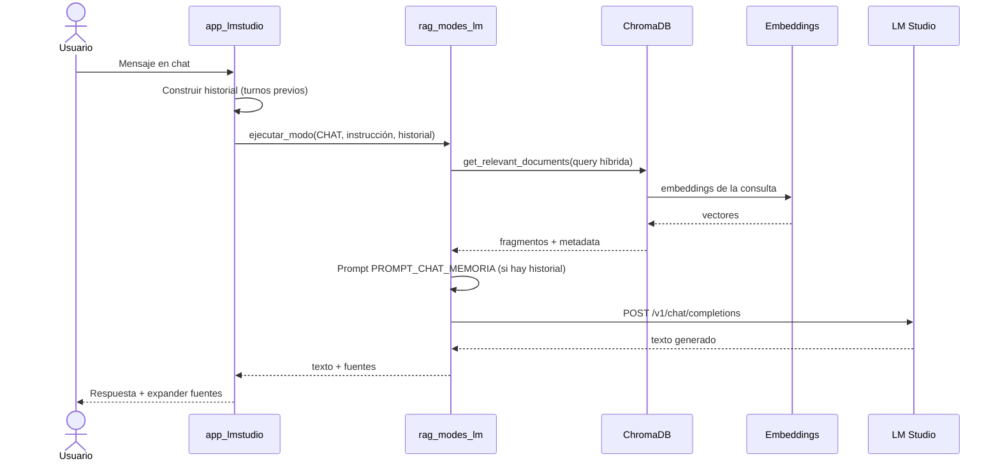
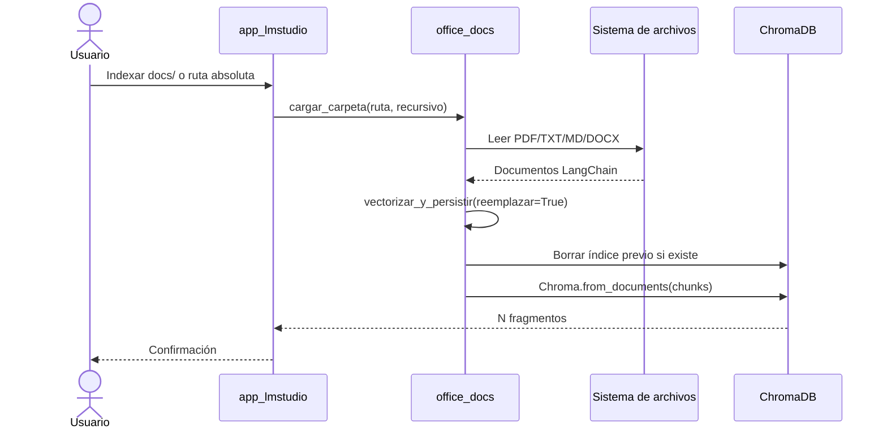
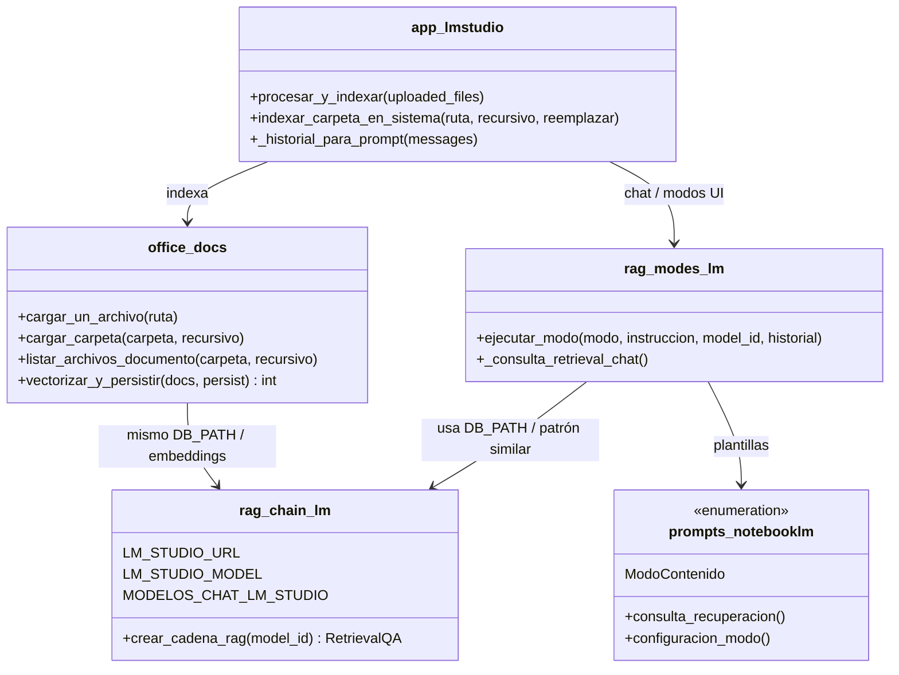
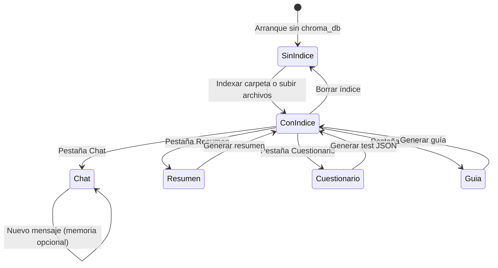
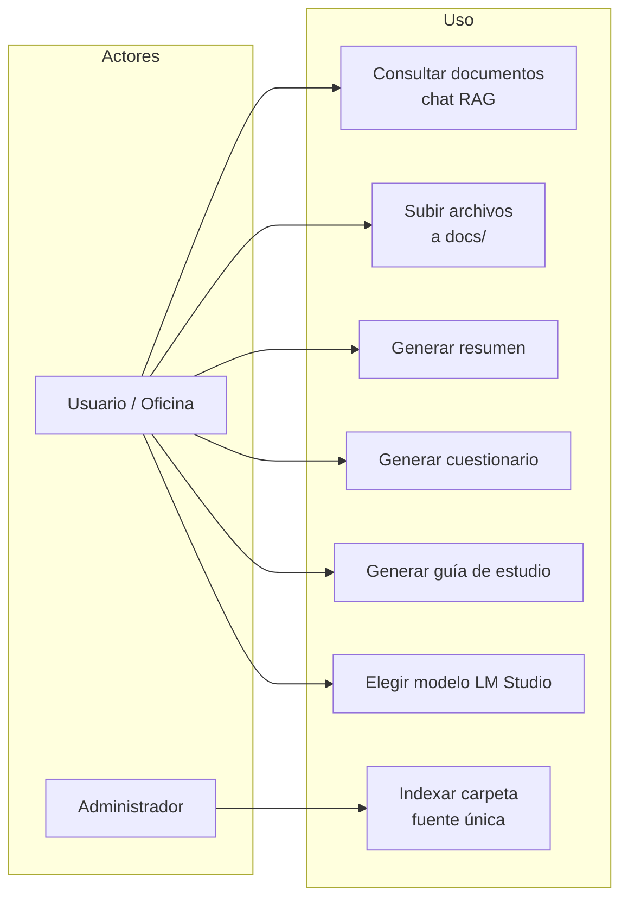

# Diagramas UML (Mermaid) — RAG local con LM Studio

Este documento recoge vistas **componentes**, **despliegue**, **secuencia**, **clases** y **estados** del sistema descrito en el código (`app_lmstudio.py`, `office_docs.py`, `rag_chain_lm.py`, `rag_modes_lm.py`, `prompts_notebooklm.py`).

---

## 1. Diagrama de componentes

---

## 2. Diagrama de despliegue (lógico)

---

## 3. Diagrama de secuencia — Chat con memoria (RAG)

---

## 4. Diagrama de secuencia — Indexar carpeta de oficina (fuente única)

---

## 5. Diagrama de clases (módulos y responsabilidades)

---

## 6. Diagrama de estados — Modos de contenido en la UI

---

## 7. Diagrama de casos de uso (resumen)

---

## Notas

- Los diagramas reflejan el diseño **actual** del código en este repositorio; si cambian los módulos, conviene actualizar este documento.
- Mermaid admite pequeñas variaciones según el visor (GitHub, GitLab, VS Code, etc.); si un diagrama no renderiza, comprueba la [sintaxis Mermaid](https://mermaid.js.org/).
